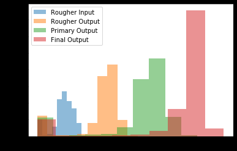

# Gold Extraction Modeling

## Project Overview

In this project, the goal is to refine parameters for optimal extraction and purification of gold ore, given inputs and outputs of various stages of the process. This project is completed without the understanding of the exact intricacies of mining, extraction, and purification.

This histogram shows the concentration levels of gold (Au) output throughout the refining process. This is our initial dataset, and supports the information supplied by showing the concentration increasing as the refining continues. The final output shows significantly higher rates of higher concentration as opposed to the other steps, including the initial ore.

For this project, our target is to find the parameters that allow for the highest concentration of gold in the final output. The dataset contains a long list of manufacturing parameters and settings. A calculation for simulating recovery is provided, to determine the coefficient of purification. The actual rougher recovery output measurements are compared to the manually calculated outputs, to determine if the calculation is a reasonable determination for actual output.

Once the data is verified and cleaned, it is divided into train and test sets, and a model is trained to determine the parameters of the highest returned gold concentrate. The data is fed to three different regression models, and ideal parameters are determined through sMAPE values. This model will be able to closely predict the ultimate gold output of an ore based on the parameters, allowing for manufacturers to optimize their production.

## Installation and Setup

This project was completed in Jupyter Notebook (.ipynb), using Python.

#### Packages Used

- General data manipulation – pandas, numpy
- Data visualization – matplotlib
- Modeling and analysis – sklearn

## Data

Data was provided by Triple10 as part of the Data Scientist bootcamp, and is unavailable outside of the notebook.

## Acknowledgements

This project was created and the data supplied by Triple10 (formerly known as Yandex Practicum) as part of the Data Scientist bootcamp program. This project was also guided by coaches from the program.
